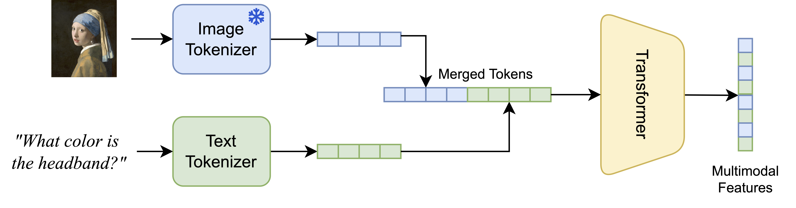

# FuseLIP: Multimodal Embeddings via Early Fusion of Discrete Tokens
Christian Schlarmann&nbsp;&nbsp;•&nbsp;&nbsp;Francesco Croce&nbsp;&nbsp;•&nbsp;&nbsp;Nicolas Flammarion&nbsp;&nbsp;•&nbsp;&nbsp;Matthias Hein



[[Paper]](https://arxiv.org/abs/2506.03096) [[HuggingFace]](https://huggingface.co/collections/chs20/fuselip-683d47bf98a27154e14c830b) [[BibTeX]](#citation) 

FuseLIP is a multimodal embedding architecture that unifies text and image inputs through early fusion. Unlike traditional contrastive models that use separate encoders and rely on late fusion, FuseLIP employs a single transformer operating on a joint vocabulary of discrete image and text tokens. This enables deep cross-modal interaction and richer representations.


## Table of Contents
- [Installation](#installation)
  - [Dataset Preparation](#dataset-preparation)
- [Pretrained Models](#pretrained-models)
- [Training](#training)
- [Evaluation](#evaluation)
- [Generating VQA Data](#generating-vqa-data-from-captions)
- [Citation](#citation)

## Installation
To install the required packages, install Python 3.11 and run:
```bash
conda install pytorch==2.5.1 torchvision==0.20.1 torchaudio==2.5.1 pytorch-cuda=12.4 -c pytorch -c nvidia  # slightly different results when installing pytorch via pip
pip install -r requirements.txt
export PYTHONPATH="$PYTHONPATH:./src"
```

### Dataset Preparation
For **training** FuseLIP, please gather the following datasets:
- [CC3M](https://huggingface.co/datasets/pixparse/cc3m-wds) and [CC12M](https://huggingface.co/datasets/pixparse/cc12m-wds): we download the datasets from HuggingFace and extract the images and captions. Cleaned CSV files are available [here](https://drive.google.com/drive/folders/1J1z9Kwe4S5a6mWFkzjcqGemWtSwPTrEo?usp=sharing) (obtained via `scripts/cc_wds_to_csv.py`).
- [CC3M-VQA](https://drive.google.com/drive/folders/1J1z9Kwe4S5a6mWFkzjcqGemWtSwPTrEo?usp=sharing)
  - we also supply CC12M-VQA, but it was not used in the paper
- [HQ-Edit](https://huggingface.co/datasets/UCSC-VLAA/HQ-Edit): will be downloaded automatically when starting training
- [Visual Genome (VG)](https://homes.cs.washington.edu/~ranjay/visualgenome/api.html): obtain the following files
  - images
  - [region descriptions](https://homes.cs.washington.edu/~ranjay/visualgenome/data/dataset/region_descriptions.json.zip)
  - [question answers](https://homes.cs.washington.edu/~ranjay/visualgenome/data/dataset/question_answers.json.zip)

For **evaluation**, please download the following datasets additionally:
- [Open Images v7](https://storage.googleapis.com/openimages/web/download_v7.html): [test images](https://storage.googleapis.com/cvdf-datasets/oid/open-images-dataset-test.tsv)
- [MMEB](https://huggingface.co/datasets/TIGER-Lab/MMEB-eval): download images via
```bash
wget https://huggingface.co/datasets/TIGER-Lab/MMEB-eval/resolve/main/images.zip
unzip images.zip -d ./eval_images/
```
- [ImageNet](https://www.image-net.org/download.php) validation set


Then set the paths to the datasets in `./src/config.py`.

## Pretrained Models
We provide pretrained FuseLIP models that can be used for evaluation or fine-tuning. The models attain the following performance:
/mnt/sda1/alex/fuselip/cc3m_data/cc3m/MMEB/eval_images/ImageNet-1K
<table>
  <thead>
    <tr>
      <th rowspan="2">Training&nbsp;Data</th>
      <th rowspan="2">Model</th>
      <th colspan="9">Evaluation metrics <small>(higher = better)</small></th>
    </tr>
    <tr>
      <th>Classification</th>
      <th>VQA</th>
      <th>Retrieval</th>
      <th>Grounding</th>
      <th>ImageNet</th>
      <th>VG-Crop</th>
      <th>OI-Crop</th>
      <th>OI-Pos</th>
      <th>TGIT</th>
    </tr>
  </thead>

  <tbody>
    <!-- CC3M + MM block -->
    <tr>
      <td rowspan="6"><code>CC3M&nbsp;+&nbsp;MM</code></td>
      <td>SigLIP-S<sub>SF</sub></td>
      <td>21.5</td><td>12.7</td><td>13.0</td><td>74.8</td><td>8.8</td><td>52.0</td><td>55.2</td><td>45.4</td><td>57.3</td>
    </tr>
    <tr>
      <td>SigLIP-S<sub>MLF</sub></td>
      <td>18.0</td><td>14.2</td><td>12.7</td><td>74.2</td><td>10.2</td><td>53.0</td><td>66.2</td><td>46.9</td><td>67.2</td>
    </tr>
    <tr>
      <td>SigLIP-B<sub>SF</sub></td>
      <td>22.2</td><td>13.6</td><td>13.4</td><td>77.2</td><td>10.3</td><td>55.1</td><td>56.9</td><td>45.9</td><td>56.6</td>
    </tr>
    <tr>
      <td>SigLIP-B<sub>MLF</sub></td>
      <td>19.5</td><td>14.8</td><td>13.9</td><td>76.9</td><td>12.2</td><td>55.4</td><td><strong>68.4</strong></td><td>47.4</td><td>69.4</td>
    </tr>
    <tr style="background-color:#eaf6ff">
      <td><a href="https://huggingface.co/chs20/FuseLIP-S-CC3M-MM">FuseLIP-S</a></td>
      <td>18.5</td><td>15.9</td><td>11.2</td><td>70.8</td><td>13.5</td><td>49.6</td><td>59.8</td><td>53.9</td><td>79.0</td>
    </tr>
    <tr style="background-color:#eaf6ff">
      <td><a href="https://huggingface.co/chs20/FuseLIP-B-CC3M-MM">FuseLIP-B</a></td>
      <td><strong>23.3</strong></td><td><strong>17.5</strong></td><td><strong>15.0</strong></td><td><strong>82.4</strong></td>
      <td><strong>18.1</strong></td><td><strong>55.8</strong></td><td>68.1</td><td><strong>70.8</strong></td><td><strong>94.3</strong></td>
    </tr>
    <!-- CC12M + MM block -->
    <tr>
      <td rowspan="6"><code>CC12M&nbsp;+&nbsp;MM</code></td>
      <td>SigLIP-S<sub>SF</sub></td>
      <td>30.4</td><td>16.2</td><td>23.8</td><td>74.2</td><td>21.4</td><td>57.1</td><td>60.1</td><td>47.1</td><td>66.0</td>
    </tr>
    <tr>
      <td>SigLIP-S<sub>MLF</sub></td>
      <td>28.5</td><td>16.9</td><td>23.2</td><td>72.7</td><td>25.5</td><td>58.8</td><td>72.2</td><td>46.6</td><td>81.0</td>
    </tr>
    <tr>
      <td>SigLIP-B<sub>SF</sub></td>
      <td><strong>31.5</strong></td><td>17.0</td><td>23.8</td><td>72.7</td><td>25.4</td><td>58.0</td><td>63.2</td><td>47.3</td><td>67.1</td>
    </tr>
    <tr>
      <td>SigLIP-B<sub>MLF</sub></td>
      <td>30.3</td><td>16.8</td><td>23.2</td><td>73.4</td><td>28.8</td><td><strong>61.5</strong></td><td><strong>74.0</strong></td><td>48.9</td><td>78.1</td>
    </tr>
    <tr style="background-color:#eaf6ff">
      <td><a href="https://huggingface.co/chs20/FuseLIP-S-CC12M-MM">FuseLIP-S</a></td>
      <td>25.2</td><td>18.2</td><td>20.1</td><td>75.2</td><td>26.0</td><td>53.5</td><td>64.7</td><td>61.5</td><td>90.6</td>
    </tr>
    <tr style="background-color:#eaf6ff">
      <td><a href="https://huggingface.co/chs20/FuseLIP-B-CC12M-MM">FuseLIP-B</a></td>
      <td>31.2</td><td><strong>19.8</strong></td><td><strong>26.2</strong></td><td><strong>82.3</strong></td>
      <td><strong>32.7</strong></td><td><strong>61.5</strong></td><td>71.3</td><td><strong>68.9</strong></td><td><strong>94.2</strong></td>
    </tr>
  </tbody>
</table>

Models can be loaded as follows:
```python
from fuse_clip.fuse_clip_utils import load_model
model, image_processor, text_tokenizer = load_model("chs20/FuseLIP-S-CC3M-MM", device="cuda")
```
## Training

Training scripts are provided for different model variants and datasets and can be run as follows:

**SigLIP-S<sub>SF</sub>,  &nbsp; SigLIP-B<sub>SF</sub>:** <br>
SigLIP with score fusion, i.e. arithmetic addition of image embedding + text embedding

```bash
# CC3M:
./scripts/train-baseline-cc3m.sh sf [small | base]
# CC12M:
./scripts/train-baseline-cc12m.sh sf [small | base]
````

**SigLIP-S<sub>MLF</sub>,  &nbsp; SigLIP-S<sub>MLF</sub>:** <br>
SigLIP with magiclens fusion - i.e. merging image and text embeddings via a small late fusion module 
```bash
# CC3M:
./scripts/train-baseline-cc3m.sh mlf [small | base]
# CC12M:
./scripts/train-baseline-cc12m.sh mlf [small | base]
```

**FuseLIP-S:**<br>
Our proposed architecture with early fusion of discrete tokens
```bash
# CC3M:
./scripts/train-fuselip-cc3m.sh small
# CC12M:
./scripts/train-fuselip-cc12m.sh small
```

**FuseLIP-B:**<br>
Our proposed architecture with early fusion of discrete tokens
```bash
# CC3M:
./scripts/train-fuselip-cc3m.sh base
# CC12M:
./scripts/train-fuselip-cc12m.sh base
```


## Evaluation

### Main evaluation
```bash
python src/fuse_eval/eval_all.py
```

### SugarCrepe
To evaluate compositionality performance on [SugarCrepe](https://github.com/RAIVNLab/sugar-crepe), run:
```bash
python src/fuse_eval/eval_sugarcrepe.py
```


## Generating VQA Data from Captions
To generate `CC3M-VQA` or `CC12M-VQA` yourself, run
```bash
python scripts/generate_vqa_data.py [--model meta-llama/Llama-3.1-8B-Instruct] [--bs 128] [--cc12m]
```
This script will use all available GPUs, using the specified batch size per device.

## Acknowledgement
This codebase gratefully forks from 
- [OpenCLIP](https://github.com/mlfoundations/open_clip)
- [TiTok](https://github.com/bytedance/1d-tokenizer)
- [VLM2Vec](https://github.com/TIGER-AI-Lab/VLM2Vec)

## Citation
If you find this project useful, please cite our paper:
```bibtex
@article{schlarmann2025fuselip,
	title = {FuseLIP: Multimodal Embeddings via Early Fusion of Discrete Tokens},
	author = {Christian Schlarmann and Francesco Croce and Nicolas Flammarion and Matthias Hein},
	year = 2025,
	journal = {arXiv preprint arXiv:2506.03096}
}
```

## Docker Setup and Training

### 1. Download ROCCO v2 Dataset
First, build and run the dataset download container:
```bash
# Create necessary directories
mkdir -p $(pwd)/ROCOv2_data
mkdir -p $HOME/.cache

# Build the download container
docker build -f Dockerfile.download -t bacor_fuselip_download .

# Run the download container
docker run --rm \
    --name bacor_fuselip_download \
    -u $(id -u):$(id -g) \
    -v $(pwd)/ROCOv2_data:/app/fuselip/ROCOv2_data \
    -v $HOME/.cache:/.cache \
    bacor_fuselip_download
```

### 2. Train the Model
After downloading the dataset, build and run the training container:
```bash
# Build the training container
docker build -f Dockerfile.train -t bacor_fuselip_train .

# Run the training container
docker run --gpus all \
    --name bacor_fuselip_train \
    -it --rm \
    -u $(id -u):$(id -g) \
    -v $(pwd)/ROCOv2_data:/workspace/ROCOv2_data \
    -v $(pwd)/trained_models:/workspace/models \
    -v $(pwd)/logs:/workspace/logs \
    -v $HOME/.cache:/.cache \
    -v $HOME/.config:/.config \
    bacor_fuselip_train small
```

The training container will:
- Use GPU acceleration with CUDA support
- Mount the ROCCO v2 dataset from your local machine
- Save trained models to `./trained_models`
- Save training logs to `./logs`
- Cache downloads in your home directory
- Run with your user permissions to avoid file ownership issues